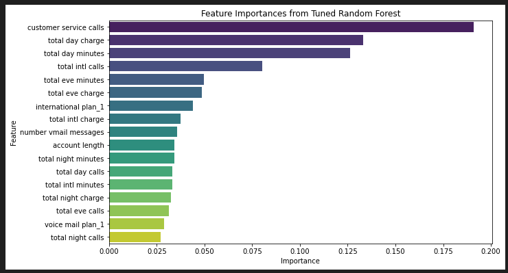

### Project Overview:
###  Customer Churn Prediction for SyriaTel

## 1.1 Business Understanding

SyriaTel, like many telecom providers, operates in a highly competitive industry where retaining existing customers is often more cost-effective than acquiring new ones. Customer churn — when subscribers stop using the service — directly impacts revenue and long-term profitability.

The challenge is that churn doesn't usually happen randomly. It can result from dissatisfaction with service quality, pricing, customer support, or competitors' offers. If SyriaTel can predict which customers are likely to churn, it can act proactively to retain them through targeted interventions.

### 1.2 Business Goals

To reduce customer churn and increase customer lifetime value (CLTV) by identifying subscribers who are most likely to leave soon.

Specifically:

i)  Build a Predictive Model for Churn

ii) Gain Insight into Churn Drivers

iii) Provide Strategic Recommendations

## 1.3 Intended Audience

a. Telecom Business Executives: Need insights into churn trends, retention ROI, and how churn relates to product pricing.

b. Marketing & Customer Retention Teams: Need a list of high-risk customers for proactive targeting.

c. Customer Experience/Call Center Managers: Want to understand which service areas such customer service calls correlate with churn.

### 2.0 Data Source
This study utilized the Churn in Telecoms dataset from Kaggle, which comprises 3,333 entries across 21 columns with no missing values, as confirmed by the .info() function. The dataset includes a mix of categorical variables such as state, international plan, voice mail plan, and churn, alongside numerical variables like total day minutes, customer service calls, and account length.

### 2.1 Data Exploration

At this stage of the analysis, several preprocessing steps were undertaken to prepare the data for modeling. First, columns with low predictive value—such as the phone number—were dropped. This was followed by descriptive analysis of numerical features to understand their distribution and central tendencies.

Next, the dataset was evaluated for class imbalance to determine whether one outcome (churn or no churn) significantly outweighed the other, which could bias the model. To ensure the data was ready for machine learning algorithms, categorical variables were converted into numeric form. One-hot encoding was specifically applied to variables like international plan and voice mail plan.

The preprocessing phase concluded with a correlation analysis between the churn variable and other features—both numerical and categorical—to assess potential relationships and identify multicollinearity concerns.

### 3.0 Modelling

Before training the models, the dataset was split into training and testing sets to enable the model to learn patterns from historical data and evaluate performance on unseen data. Standard scaling was then applied to numerical columns in the training set. 

To address the class imbalance observed in the target variable, the SMOTE technique was used. After resampling, the training dataset became perfectly balanced, with 50% of the samples representing customers who did not churn and 50% representing those who did.

After applying SMOTE, the resampled training data was initially fitted into a logistic regression model. The model was then used for prediction and evaluated using metrics such as accuracy, precision, recall, confusion matrix, and ROC curves. 

Two additional models—Random Forest and Decision Tree—were also trained on the same dataset and evaluated using the same metrics. To enhance performance, both models were further subjected to hyperparameter tuning to assess whether the evaluation metrics would improve.

### 3.1 Evaluation

key findings 

Logistic model

The Logistic Regression model achieved an accuracy of **0.72**, with a **precision of 0.30**, **recall of 0.71**, and **F1 score of 0.42**. The confusion matrix revealed 103 true positives, 42 false negatives, 239 false positives, and 616 true negatives. In terms of cross-validation, the model achieved an average accuracy of 75% across 5 folds, indicating a reasonably good ability to distinguish between churned and non-churned customers. The AUC score of 0.8015 suggests that the model has an 80.15% chance of correctly ranking a randomly chosen churned customer above a non-churned one, highlighting decent discriminative power despite its lower precision.

**Decision trees**

The Decision Tree model achieved an accuracy of 0.88, with precision of 0.56 and recall of 0.75. The confusion matrix showed 769 true negatives, 86 false positives, 36 false negatives, and 109 true positives. With a cross-validation accuracy of 0.86, the model demonstrated consistent performance across folds, correctly classifying 86% of the customers on average.

**Random Forest**

The Random Forest model outperformed the others with an accuracy of 0.90, precision of 0.64, and recall of 0.73. It recorded 795 true negatives, 60 false positives, 39 false negatives, and 106 true positives. The model maintained strong generalization ability, with a cross-validation accuracy of 0.87, correctly identifying 87% of customers across different data splits.

 ### 3.2 After hyperparameter tuning

**Accuracy**

Decision Tree (90%): Accuracy improved from ~84%, now more stable across folds (±0.01 std), but still vulnerable to overfitting on complex patterns.

Random Forest (95%): Highest accuracy and stability (±0.01 std); tuning enhanced generalization and minimized overfitting through ensemble learning.

**ROC Score Comparison:**

Tuned Random Forest: AUC = 0.89 — Best overall performance.

Tuned Decision Tree: AUC = 0.86 — Strong performer, just behind Random Forest.

Logistic Regression: AUC = 0.80 — Lowest among the three, but still a reliable baseline.

## 3.3 Feature selection

customer service calls emerge as the most important feature in determining the likelihood of a customer churning. This suggests that customers who contact customer service frequently may be more likely to leave, potentially due to unresolved issues or dissatisfaction. 

It is closely followed by total day charge and total day minutes, indicating that higher daytime usage and associated charges could also be significant indicators of churn behavior.

## 4.0 Recommendations

To reduce churn and boost customer lifetime value, key actions should focus on insights from model results and feature importance:

* **Improve Customer Support**: Since service calls are a top churn driver, enhance support quality through satisfaction surveys, call sentiment analysis, and agent training.

* **Target High Usage Customers**: Customers with high total day charges/minutes are at risk. Retain them with personalized offers, loyalty rewards, and proactive outreach using churn risk scores.

* **Close the Loop**: Integrate churn insights into business reviews and regularly update models to reflect changing customer behavior.

* **Deploy Smartly**: Use the tuned **Random Forest model** (AUC = 0.89) for prediction, and the **Decision Tree** for clear insight sharing with stakeholders.
